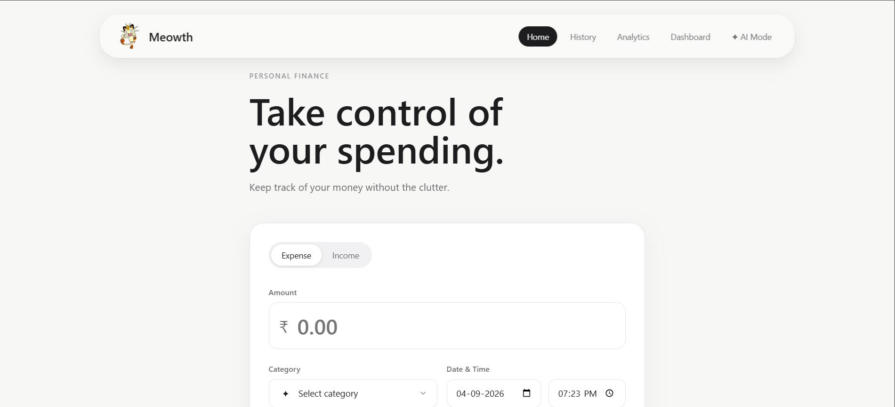
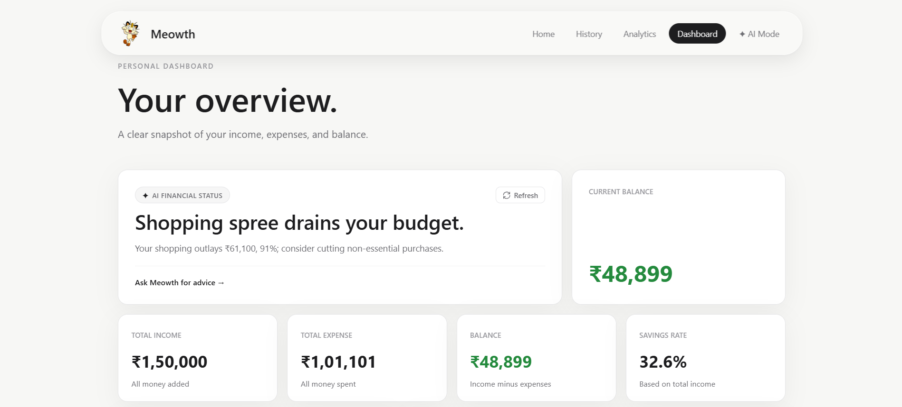
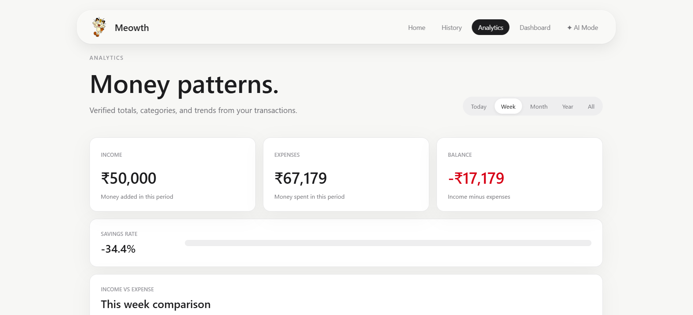
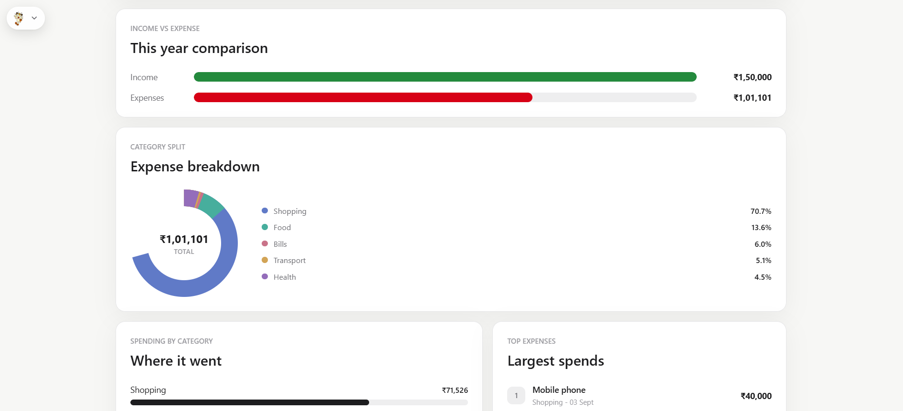
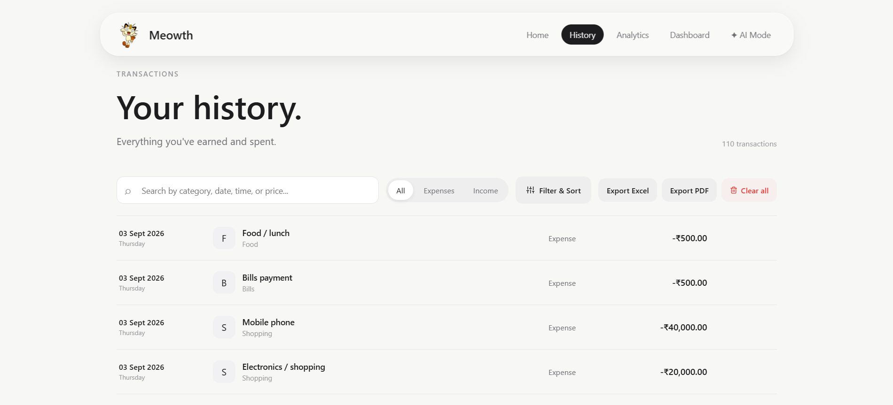
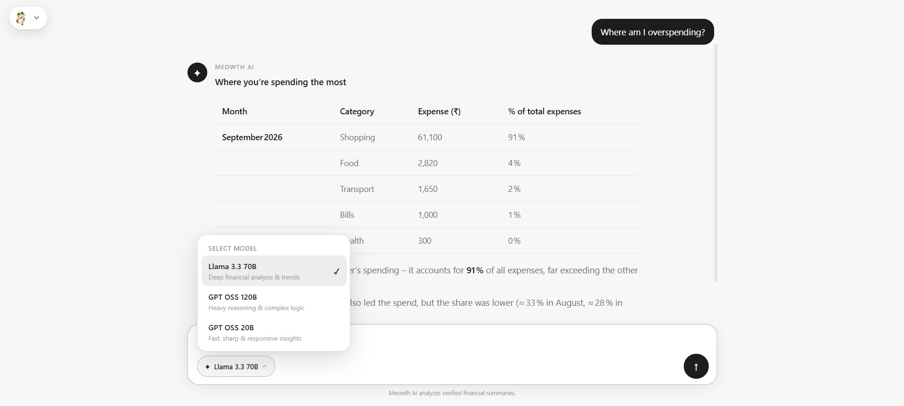
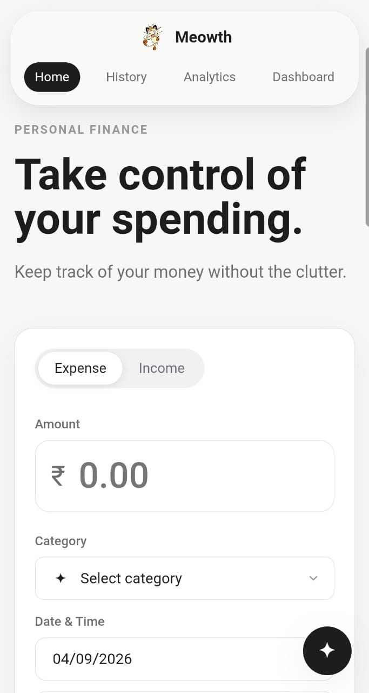
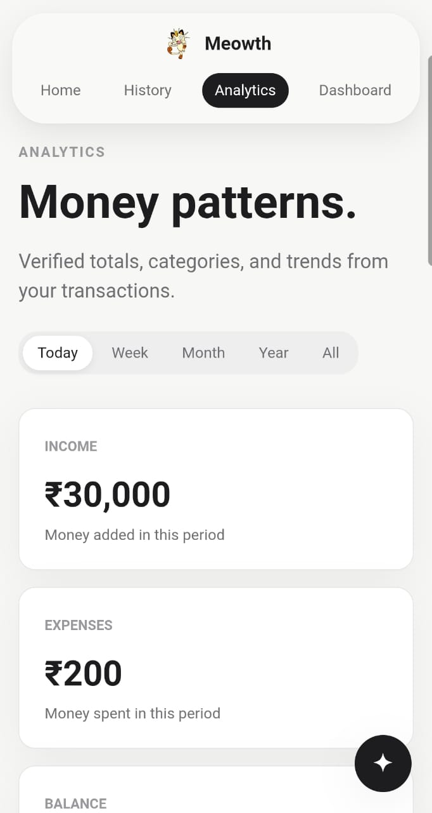
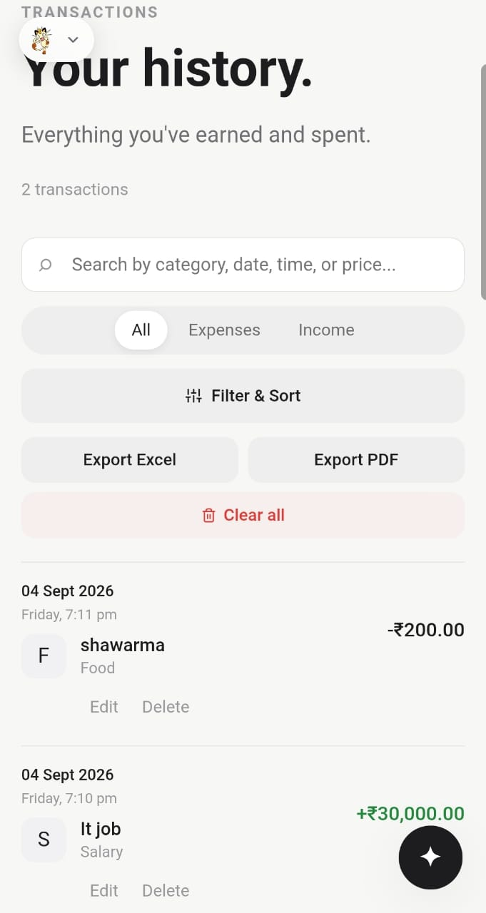

<div align="center">
  

  # 🐱 Meowth Smart Finance & Expense Tracker

  <p align="center">
    <strong>A fast, privacy-focused personal finance manager and AI financial advisor — now available on Web and Native Android.</strong>
  </p>

  <p align="center">
    <a href="https://meowth-smart.netlify.app/"></a>
    <a href="app/meowth.apk"></a>
    
    
    
  </p>

  <p align="center">
    <a href="#-features">Features</a> •
    <a href="#-visual-showcase">Screenshots</a> •
    <a href="#-download--install-android-app">Android APK</a> •
    <a href="#-how-we-built-the-android-app-capacitor">How We Built the App</a> •
    <a href="#-running-locally">Running Locally</a> •
    <a href="#-privacy--architecture">Privacy</a>
  </p>
</div>

---

## 📖 Overview

**Meowth Smart Finance** is a lightweight, responsive personal expense tracker designed to help you understand your spending habits without clutter. Powered by modern vanilla web technologies and bundled into a native mobile app with **Ionic Capacitor**, it pairs real-time financial tracking with an integrated **AI Financial Assistant (Meowth AI)** running Groq's high-speed **Llama 3.3 70B**.

All your financial data is kept **100% private and offline-first** inside your device's local storage.

---

## 📱 Download & Install Android App

You can install and run Meowth directly on your Android phone without going through the Play Store!

### 📥 Direct Download
* **File:** [`app/meowth.apk`](app/meowth.apk) *(~11 MB)*
* **Version:** v1.0.0 (Release APK)
* **Compatibility:** Android 8.0+ (API 26+)

### 📲 How to Install on Your Phone:
1. Download **`app/meowth.apk`** to your phone (or download this repo and send the APK file via WhatsApp / Google Drive / USB).
2. Tap on **`meowth.apk`** in your phone's file manager or downloads.
3. If prompted by Android, toggle **"Allow installation from unknown sources"**.
4. Tap **Install** and launch **Meowth**!

---

## 📸 Visual Showcase

### 🖥️ Desktop Experience

| Home / Transaction Entry | Financial Dashboard |
| :---: | :---: |
|  |  |

| Deep Analytics & Savings Rate | Category Donut & Trends |
| :---: | :---: |
|  |  |

| Transaction History & Filter Drawer | Meowth AI Chat Mode |
| :---: | :---: |
|  |  |

---

### 📱 Android Mobile App Experience

<div align="center">
  <table border="0">
    <tr>
      <td align="center" width="33%">
        <strong>Mobile Home</strong><br/><br/>
        
      </td>
      <td align="center" width="33%">
        <strong>Mobile Analytics</strong><br/><br/>
        
      </td>
      <td align="center" width="33%">
        <strong>Mobile History</strong><br/><br/>
        
      </td>
    </tr>
  </table>
</div>

---

## ✨ Features

- **⚡ Fast Transaction Entry:** Add income and expenses instantly with automatic timestamps, categories, custom descriptions, and Indian Rupee (`₹`) formatting.
- **📊 Comprehensive Analytics:**
  - Interactive SVG Area Charts with dynamic hover tooltips.
  - Category breakdown Donut Charts with auto-calculated percentages.
  - Monthly comparisons and financial health savings rate indicators.
- **🧠 Meowth AI Financial Assistant:**
  - Ask questions about your spending in natural language (*"Where am I overspending?"*, *"How did July compare to August?"*).
  - Powered by **Groq API** with fallback model routing (**Llama 3.3 70B** and **GPT-OSS**).
  - Supports streaming responses and persistent conversation chat history with custom naming and deletion confirmations.
- **📱 Smart Mobile UI Innovations:**
  - **Auto-Hiding Header:** Scrolling down smoothly tucks the navbar away to maximize mobile screen space.
  - **Floating Summon Button:** A subtle, glassmorphic button appears on the top-left to immediately summon the navbar back with a single tap.
  - **Touchscreen Optimized:** High-contrast touch targets, swipe-to-dismiss toast notifications, and full-width typing composers.
- **🎨 Visual Polish & Themes:**
  - Seamless Android 12+ native splash screen with custom Meowth branding.
  - Animated in-app Meowth GIF loading screen with synchronized `#f7f7f5` background to eliminate startup flashes.
- **🔒 100% Private & Offline-First:**
  - Zero required cloud logins. All transactions stay on your phone/browser in **HTML5 LocalStorage**.
- **💾 Backup, Import & Export:** Export your entire ledger to formatted Excel / PDF or restore from JSON backup anytime.

---

## 🛠️ How We Built the Android App (Capacitor)

We transitioned our Vanilla HTML5/CSS3/JavaScript web project into a native Android app using **Ionic Capacitor** without abandoning our zero-dependency frontend.

### 1. The Architecture Pipeline
```
[ Vanilla Web Code ] (index.html, css/, js/)
       │
       ▼  npm run build
[ Distribution Directory ] (www/)
       │
       ▼  npx cap sync android
[ Native Android Project ] (android/app/src/main/assets/public)
       │
       ▼  Gradle Build / Android Studio
[ Standalone APK ] (app/meowth.apk)
```

### 2. Key Engineering Steps:
1. **Build Automation:** Configured `package.json` scripts (`npm run build` and `npm run sync`) to automatically synchronize all HTML, CSS, JavaScript, and logo assets directly into Capacitor's `www/` asset bundle.
2. **Dynamic AI Endpoint Resolution:** In web mode, AI calls route to relative Netlify serverless functions (`/.netlify/functions/ai-chat`). Inside the native Android container (running on `https://localhost`), the app dynamically prefixes requests to the production Netlify cloud backend:
   ```javascript
   const apiBase = window.location.origin.includes("netlify.app")
       ? ""
       : "https://meowth-smart.netlify.app";
   ```
3. **CORS Whitelisting:** Updated Netlify serverless functions with strict origin validation supporting both web domains and Capacitor mobile WebViews (`https://localhost`, `capacitor://localhost`).
4. **Eliminating Startup Black Flash:** Synchronized Android's native `AppTheme.NoActionBarLaunch`, `AppTheme.NoActionBar`, and Capacitor's `backgroundColor` to `#f7f7f5`. This eradicated the split-second black screen on Dark Mode Android devices between the OS splash screen and the WebView first paint.
5. **Adaptive App Icon & Custom Splash:** Created customized launcher assets (`ic_launcher.webp`) across all Android density buckets (`hdpi`, `xhdpi`, `xxhdpi`, `xxxhdpi`) alongside an in-app animated loading screen.

---

## 🚀 Running Locally

### Web Development
```bash
# 1. Clone repository
git clone https://github.com/AbhijithBabu12/expense-tracker-Abhijith-Babu.git
cd expense-tracker-Abhijith-Babu

# 2. Install dependencies
npm install

# 3. Add your Groq API key in .env
echo "GROQ_API_KEY=your_key_here" > .env

# 4. Start local development server with Netlify Functions
netlify dev
```

### Android Development & Testing
```bash
# 1. Build and sync web assets to Android
npm run sync

# 2. Open project in Android Studio
npx cap open android

# 3. Inside Android Studio, click Run (▶) or Build > Build APK(s)
```

---

## 🔒 Privacy & Data Guarantee

* **No tracking, no analytics trackers, no third-party cookies.**
* Your transactions are stored strictly in your device's browser/app storage (`localStorage`).
* When using **Meowth AI**, only an aggregated, verified monthly context summary is transmitted over HTTPS to the serverless proxy to answer your query. Raw sensitive data is never saved on any database.

---

## 📄 License

This project is open source and available under the [ISC License](LICENSE).
